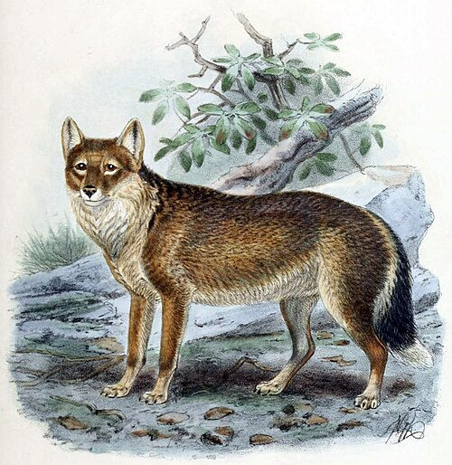

[](https://crates.io/crates/warrah)
[](https://github.com/evgenyneu/warrah/actions/workflows/release.yml)
[](https://github.com/evgenyneu/warrah/actions/workflows/tests.yml)
[](UNLICENSE)

# Warrah

`warrah` is a command-line utility and a Rust library that **naively** removes code comments from a text file and outputs the result to stdout:

```sh
> warrah code.py
```

Please note Warrah is a very lazy comments remover because it doesn't fully parse the code. It uses simple and fast logic to detect single- and multi-line comments. Consequently, it will remove comments inside strings and may result in invalid code. The main use of this utility is to strip comments from code in order to feed it to an LLM, where occasionally incorrect code is fine. Thus the main focus here is on speed, low resource usage, language coverage and simplicity, not correctness.


## Supported languages

The program supports single and multi-line comments in the following languages:

1. Ada
1. Assembly
1. Bash
1. C
1. C#
1. C++
1. COBOL
1. CMake
1. CoffeeScript
1. CSS
1. D
1. Dart
1. Dockerfile
1. EJS
1. Elixir
1. Elm
1. Erlang
1. F#
1. Fortran
1. Gherkin (Cucumber BDD)
1. Go
1. Gradle
1. Groovy
1. Handlebars / Mustache
1. Haskell
1. Haxe
1. HCL (HashiCorp Configuration Language)
1. HTML
1. INI
1. Java
1. JavaScript
1. Jinja2
1. JSONC (JSON with Comments)
1. JSX / TSX (React)
1. Julia
1. Kotlin
1. LaTeX
1. Less
1. Liquid
1. Lisp / Clojure / Scheme
1. Makefile
1. Markdown
1. MATLAB / Octave
1. Objective-C
1. Org-mode
1. Perl
1. PHP
1. PowerShell
1. Prolog
1. Python
1. QML (Qt Modeling Language)
1. R
1. Rego (Open Policy Agent)
1. Ruby
1. Rust
1. SASS / SCSS
1. Scala
1. Shell
1. SQL
1. Starlark (Bazel build language)
1. Swift
1. Terraform
1. TOML
1. Twig
1. TypeScript
1. VB / VBScript
1. Verilog / SystemVerilog
1. Vue
1. XML
1. YAML
1. Zig

See [docs/languages.md](docs/languages.md) for more details about the types of comments supported in each language.

## Installation

### Install using Cargo

First [install Rust](https://www.rust-lang.org/tools/install), then run:

```bash
cargo install warrah
```

### Homebrew

Install with [Homebrew](https://brew.sh/):

```bash
brew tap evgenyneu/warrah
brew install warrah
```

### Pre-built binaries

Download pre-built binaries from the [GitHub Releases page](https://github.com/evgenyneu/warrah/releases).

1. Download the appropriate version for your platform.
2. Move the binary to a location in your PATH.


## Usage

```bash
warrah [PATH]
```

*PATH*: The path to the code file to strip comments from. The program will automatically detect the language based on the file extension or file name.

The output is sent to stdout. If you want to save the output to a file, use the `>` operator on Unix-like systems:

```bash
warrah code.py > code_no_comments.py
```

## Development

See [docs/development.md](docs/development.md) for instructions on how to set up the development environment.


## Contributing

See contributing guidelines in [CONTRIBUTING.md](CONTRIBUTING.md).

## What's Warrah?

The warrah, or Falkland Islands wolf (Dusicyon australis), also known as the "Antarctic wolf," was the only native land mammal of the Falkland Islands. It was hunted by settlers for its fur and perceived threat to livestock, leading to its extinction in 1876.




*Falkland Island fox or "Antarctic Wolf" by John Gerrard Keulemans, from St. George Mivart's Dogs, Jackals, Wolves, and Foxes: A Monograph of the Canidae, published by R. H. Porter, London, 1890. Lithography by Mintern Brothers. Source: [Wikimedia Commons](https://commons.wikimedia.org/wiki/File:FalklandIslandFox2.jpg).*


## Feedback is welcome

If you need help or notice a bug, feel free to create an issue ticket. We will be happy to help. :D


## The unlicense

This work is in [public domain](UNLICENSE).
